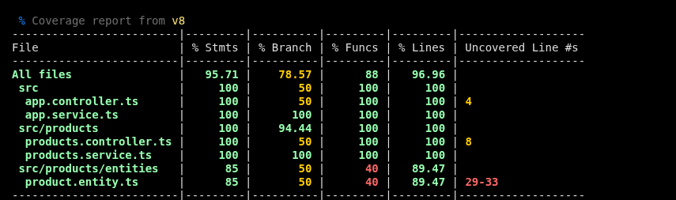

# HU-004 — Administración de Productos del Menú

| | |
|---|---|
| **Épica** | Gestión del Menú |
| **Sprint** | Sprint 1 |
| **Prioridad** | Muy Alta |
| **Story Points** | 13 |
| **Rama** | `feature/hu-004-products` |

## 1. Descripción

API REST para que el administrador del restaurante cree y administre los productos del menú. Cada producto tiene nombre, descripción, precio, categoría, disponibilidad y estado, y siempre pertenece a una categoría existente.

## 2. Stack

| Componente | Tecnología |
|---|---|
| Framework | NestJS 12 (Node.js, ESM) |
| Lenguaje | TypeScript |
| Base de datos | PostgreSQL 16 (Docker) |
| ORM | TypeORM |
| Validación | class-validator + class-transformer |
| Testing | Vitest + `@vitest/coverage-v8` |
| Lint / formato | oxlint / Prettier |

## 3. Modelo de datos

**Tabla `products`**

| Campo | Tipo | Notas |
|---|---|---|
| `id` | uuid | PK, generado |
| `name` | varchar(150) | obligatorio |
| `description` | text | opcional |
| `price` | decimal(10,2) | mayor que cero; se devuelve como `number` |
| `category_id` | uuid | FK a `categories`, `ON DELETE RESTRICT` |
| `availability` | enum | `AVAILABLE` (default) / `UNAVAILABLE` |
| `status` | enum | `ACTIVE` (default) / `INACTIVE` |
| `created_at` / `updated_at` | timestamp | automáticos |

## 4. Endpoints

Base: `/api/v1/products`

| Método | Ruta | Descripción | Respuestas |
|---|---|---|---|
| POST | `/` | Crear producto | 201, 400 |
| GET | `/` | Listar todos los productos (administración) | 200 |
| GET | `/menu` | Menú público: solo productos `ACTIVE` | 200 |
| GET | `/:id` | Consultar un producto | 200, 400, 404 |
| PATCH | `/:id` | Actualizar nombre, descripción, precio o categoría | 200, 400, 404 |
| PATCH | `/:id/status` | Activar o desactivar | 200, 400, 404 |
| PATCH | `/:id/availability` | Cambiar disponibilidad | 200, 400, 404 |

> `GET /menu` se declara antes de `GET /:id` para que Nest no interprete `menu` como un id.

### Ejemplo: crear producto

```http
POST /api/v1/products
Content-Type: application/json

{
  "name": "Pasta Alfredo",
  "description": "Pasta con salsa cremosa",
  "price": 25000,
  "categoryId": "3f2b8c1e-8a4d-4c1a-9b7e-1a2b3c4d5e6f"
}
```

```json
{
  "id": "b1d4...",
  "name": "Pasta Alfredo",
  "description": "Pasta con salsa cremosa",
  "price": 25000,
  "status": "ACTIVE",
  "availability": "AVAILABLE"
}
```

### Ejemplo: error de validación (400)

```json
{
  "message": [
    "El nombre es obligatorio",
    "El precio debe ser mayor que cero",
    "CategoryId debe ser un UUID valido"
  ],
  "error": "Bad Request",
  "statusCode": 400
}
```

## 5. Validaciones

Se implementan con DTOs de class-validator y un `ValidationPipe` global (`whitelist: true`, `transform: true`), que descarta campos no declarados.

| Campo | Regla | Mensaje |
|---|---|---|
| `name` | texto, sin espacios sobrantes, 1 a 150 caracteres | El nombre es obligatorio |
| `description` | opcional, texto | La descripción debe ser texto |
| `price` | número mayor que cero | El precio debe ser mayor que cero |
| `categoryId` | UUID válido | CategoryId debe ser un UUID valido |
| `status` | `ACTIVE` o `INACTIVE` | status debe ser ACTIVE o INACTIVE |
| `availability` | `AVAILABLE` o `UNAVAILABLE` | availability debe ser AVAILABLE o UNAVAILABLE |
| `:id` (ruta) | UUID (`ParseUUIDPipe`) | 400 si no es UUID |

## 6. Reglas de negocio

| Regla | Implementación |
|---|---|
| RN-025 Pertenece a una categoría existente | `ProductsService.create()` / `update()` lanzan `BadRequestException` si la categoría no existe |
| RN-026 Precio mayor que cero | `@IsPositive` en el DTO |
| RN-027 Nuevo producto inicia `ACTIVE` | Default de la columna `status` |
| RN-028 Nuevo producto inicia `AVAILABLE` | Default de la columna `availability` |
| RN-029 `INACTIVE` no se muestra en el menú | `GET /menu` → `findAllForMenu()` filtra por `ACTIVE` |
| RN-030 `UNAVAILABLE` no se agrega a pedidos | `assertAvailableForOrder()` lanza `BadRequestException`; `ProductsService` se exporta para el módulo de pedidos |

## 7. Estructura del módulo

```
src/
├── products/
│   ├── dto/
│   │   ├── create-product.dto.ts
│   │   ├── update-product.dto.ts
│   │   ├── update-status.dto.ts
│   │   ├── update-availability.dto.ts
│   │   └── product.dto.spec.ts
│   ├── entities/product.entity.ts
│   ├── products.controller.ts (+ .spec.ts)
│   ├── products.service.ts    (+ .spec.ts)
│   └── products.module.ts
└── categories/
```

## 8. Pruebas (Testing)




### 8.1 Ejecución

```bash
npm run test        # pruebas unitarias
npm run test:cov    # pruebas + reporte de cobertura
```

### 8.2 Suites

| Suite | Qué valida |
|---|---|
| `products.controller.spec.ts` | Cada endpoint delega en el service con los argumentos correctos (incluye `findMenu`) |
| `products.service.spec.ts` | RN-025, RN-029 y RN-030; `create`, `findAll`, `findOne`, `update` (categoría inexistente, valores conservados), `changeStatus`, `changeAvailability` |
| `product.dto.spec.ts` | Validaciones de los DTOs: nombre, precio (RN-026), UUID, trim, enums y `PartialType` |
| `app.controller.spec.ts` | Controlador base |

Los tests del service y del controller usan repositorios y servicios simulados (`vi.fn()`), por lo que no necesitan base de datos.

### 8.3 Reporte de cobertura (`vitest --coverage`, proveedor v8)

| Archivo | % Stmts | % Branch | % Funcs | % Lines | Líneas sin cubrir |
|---|---|---|---|---|---|
| **All files** | **95.71** | **78.57** | **88** | **96.96** | |
| `src/app.controller.ts` | 100 | 50 | 100 | 100 | 4 |
| `src/app.service.ts` | 100 | 100 | 100 | 100 | |
| `src/products/products.controller.ts` | 100 | 50 | 100 | 100 | 8 |
| `src/products/products.service.ts` | 100 | 100 | 100 | 100 | |
| `src/products/entities/product.entity.ts` | 85 | 50 | 40 | 89.47 | 29-33 |

**Exclusiones del reporte** (`vitest.config.ts`): `src/categories/**`, `**/*.dto.ts`, `**/*.module.ts`, `src/main.ts`, `dist/**` y `test/**`. Los DTO se excluyen porque son clases declarativas y ya tienen su propia suite de validación.

### 8.4 Observaciones

- **Lógica de negocio al 100 %:** `products.service.ts` alcanza 100 % en las cuatro métricas y `products.controller.ts` en sentencias, funciones y líneas.
- **Branch en 50 %:** la rama sin cubrir en `app.controller.ts`, `products.controller.ts` y `product.entity.ts` no corresponde a código propio. Es la expresión que el compilador genera para los metadatos de los decoradores (`typeof Clase === "undefined" ? Object : Clase`); su segunda opción nunca puede ejecutarse. El resultado es igual con el proveedor `istanbul`.
- **`product.entity.ts` (líneas 29-33):** corresponden a las funciones `to` y `from` del *transformer* de `price`, que convierte el `decimal` de PostgreSQL (texto) en `number`.

## 9. Configuración y ejecución

```bash
docker compose up -d        # PostgreSQL en el puerto 5432
npm install
npm run start:dev           # API en http://localhost:3000
```

Variables de entorno (`.env`): `PORT`, `DB_HOST`, `DB_PORT`, `DB_USER`, `DB_PASSWORD`, `DB_NAME`.

> `synchronize: true` crea las tablas automáticamente y es solo para desarrollo. En producción deben usarse migraciones.

## 10. Criterios de aceptación

| Criterio | Estado |
|---|---|
| Registrar un producto | ✅ |
| Producto asociado a una categoría | ✅ |
| Rechazar precios ≤ 0 | ✅ |
| Listar y consultar productos | ✅ |
| Actualizar un producto | ✅ |
| Activar / desactivar | ✅ |
| Cambiar disponibilidad | ✅ |
| Inactivos fuera del menú público | ✅ |
| No disponibles fuera de nuevos pedidos | ✅ (`assertAvailableForOrder`, a integrar en el módulo de pedidos) |
| Datos en PostgreSQL | ✅ |