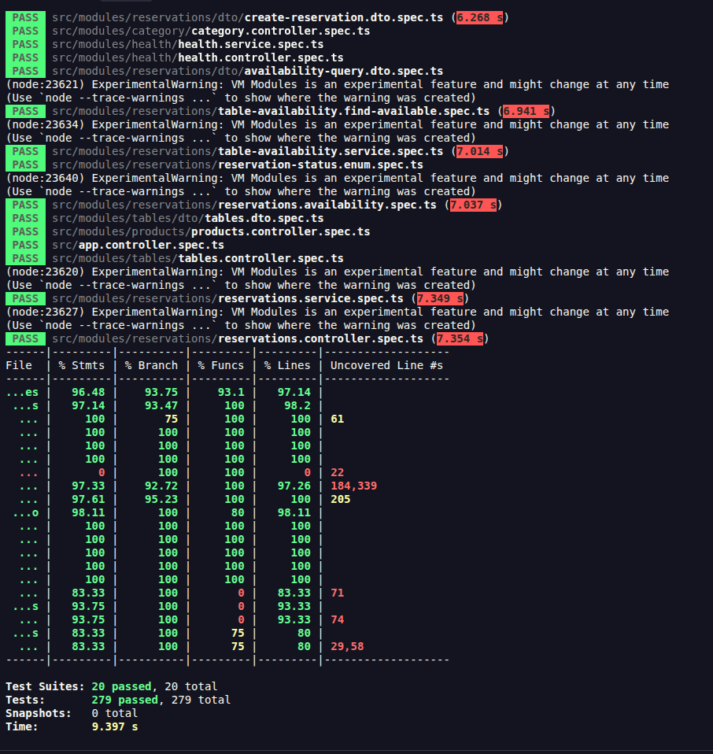

# HU-006: Consulta de disponibilidad de mesas

**Autor:** Jose Vargas
**Épica:** Gestión de Reservas
**Sprint:** Sprint 2
**Prioridad:** Crítica
**Story Points:** 13

## 1. Historia de usuario

Como cliente del restaurante,
quiero consultar la disponibilidad de mesas para una fecha, hora y cantidad de personas,
para saber si puedo realizar una reserva.

## 2. Endpoint

| Método | Ruta                                | Descripción                                                     |
| ------ | ----------------------------------- | --------------------------------------------------------------- |
| GET    | `/api/v1/reservations/availability` | Lista las mesas que se pueden reservar para el horario indicado |

Ejemplo:

```
GET /api/v1/reservations/availability?date=2026-12-20&time=19:00&guests=4
```

### Parámetros (query string)

| Parámetro         | Tipo    | Obligatorio | Descripción                                        |
| ----------------- | ------- | ----------- | -------------------------------------------------- |
| `date`            | string  | Sí          | Día de la reserva, formato `YYYY-MM-DD`            |
| `time`            | string  | Sí          | Hora de inicio, formato 24 horas `HH:mm`           |
| `guests`          | integer | Sí          | Número de personas, mayor que cero                 |
| `durationMinutes` | integer | No          | Duración de la estancia en minutos (15 a 480). Por defecto 120 |

## 3. Reglas de negocio

| Regla            | Descripción                                                                  | Dónde se aplica                          |
| ---------------- | ---------------------------------------------------------------------------- | ---------------------------------------- |
| RN-036           | La cantidad de personas debe ser mayor que cero                              | `AvailabilityQueryDto` y `ReservationsService` |
| RN-037 / RN-042  | No se consultan fechas ni horas pasadas                                      | `ReservationsService`                    |
| RN-038 / RN-041  | Solo se consideran mesas `AVAILABLE`; las `OUT_OF_SERVICE` se descartan      | `TableAvailabilityService` (consulta SQL) |
| RN-039           | La capacidad de la mesa debe ser mayor o igual que las personas              | `TableAvailabilityService` (consulta SQL) |
| RN-040           | Una mesa con una reserva que se cruce con el horario no está disponible      | `TableAvailabilityService`               |
| Generales        | Fecha y hora son obligatorias y con formato válido                           | `AvailabilityQueryDto`                   |

### Cálculo de conflictos (RN-040)

Cada reserva ocupa un intervalo `[inicio, inicio + duración)`. Dos intervalos se cruzan si cada uno empieza antes de que el otro termine. Una reserva que empieza justo cuando otra termina no genera conflicto (por ejemplo, 17:00 a 19:00 y 19:00 a 21:00 pueden compartir mesa).

Solo bloquean la mesa las reservas en estado `PENDING`, `CONFIRMED` y `CHECKED_IN`. Las `CANCELLED`, `NO_SHOW` y `COMPLETED` no la ocupan.

## 4. Respuestas

### 200: hay disponibilidad

Las mesas vienen ordenadas de menor a mayor capacidad (la de mejor ajuste primero).

```json
{
  "available": true,
  "reason": "AVAILABLE",
  "message": "Tables are available for the requested slot",
  "date": "2026-12-20",
  "time": "19:00",
  "guests": 4,
  "durationMinutes": 120,
  "tables": [
    { "id": 2, "tableNumber": 2, "capacity": 4, "zone": "INDOOR" },
    { "id": 5, "tableNumber": 5, "capacity": 6, "zone": "OUTDOOR" }
  ]
}

### 200: no hay disponibilidad

Que no haya mesas es una respuesta válida a la consulta, no un error, por eso se responde 200 con `available: false`, el motivo y un mensaje claro.

```json
{
  "available": false,
  "reason": "SCHEDULE_CONFLICT",
  "message": "No table is free for the requested date and time",
  "date": "2026-12-20",
  "time": "19:00",
  "guests": 4,
  "durationMinutes": 120,
  "tables": []
}
```

Valores posibles de `reason`:

| Valor                  | Significado                                                       |
| ---------------------- | ----------------------------------------------------------------- |
| `AVAILABLE`            | Hay al menos una mesa disponible                                  |
| `NO_CAPACITY`          | Ninguna mesa del restaurante tiene capacidad suficiente           |
| `NO_OPERATIONAL_TABLE` | Las mesas con capacidad suficiente no están en estado `AVAILABLE` |
| `SCHEDULE_CONFLICT`    | Las mesas aptas ya tienen una reserva que se cruza con el horario |

### 400: solicitud inválida

Errores de formato o campos faltantes (los genera el `ValidationPipe`):

```json
{
  "message": ["guests must be greater than zero"],
  "error": "Bad Request",
  "statusCode": 400
}
```

Errores de regla de negocio (fecha u hora pasada, personas menores a uno):

```json
{
  "error": "Reservations cannot be registered for a past date or time (requested 2020-01-01 19:00)",
  "rule": "RN-037 / RN-042"
}
```

## 5. Arquitectura

Todo el código está en `src/modules/reservations/`.

| Archivo                                  | Responsabilidad                                                              |
| ---------------------------------------- | ---------------------------------------------------------------------------- |
| `reservations.controller.ts`             | Expone `GET /reservations/availability` con su documentación Swagger        |
| `reservations.service.ts`                | `checkAvailability()`: valida RN-036 y RN-037/042 y arma la respuesta        |
| `table-availability.service.ts`          | `findAvailable()`: consulta mesas y descarta las que tienen conflicto        |
| `dto/reservation-query.dto.ts`           | `AvailabilityQueryDto`: validación de `date`, `time`, `guests` y `durationMinutes` |
| `dto/availability-response.dto.ts`       | `AvailabilityResponseDto`: esquema de respuesta para Swagger                 |
| `reservation.constants.ts`               | Constantes y códigos de reglas (`AVAILABILITY_RULES`)                        |
| `reservation-time.util.ts`               | Utilidades de fecha, hora e intervalos                                       |

### Flujo

1. `ValidationPipe` valida y transforma el query string en `AvailabilityQueryDto`.
2. `ReservationsService.checkAvailability()` rechaza fechas pasadas y personas menores a uno.
3. `TableAvailabilityService.findAvailable()` ejecuta una consulta en PostgreSQL de las mesas `AVAILABLE` con `capacity >= guests`, ordenadas por capacidad.
4. Con los ids candidatos consulta las reservas del mismo día que bloquean mesa y descarta las que se cruzan.
5. El servicio devuelve la lista y, si está vacía, el motivo y el mensaje.

La consulta es de solo lectura: no bloquea filas ni modifica mesas. La disponibilidad refleja en tiempo real las reservas guardadas en la base de datos. El resultado es informativo: al crear la reserva (`POST /reservations`) se vuelve a comprobar dentro de una transacción con bloqueo, por lo que una mesa mostrada como libre puede ocuparse antes de que el cliente confirme.

## 6. Pruebas

| Archivo                                                  | Qué cubre                                                              |
| -------------------------------------------------------- | ---------------------------------------------------------------------- |
| `dto/availability-query.dto.spec.ts`                     | Campos obligatorios, formato de fecha y hora, `guests` inválido, rango de duración |
| `table-availability.find-available.spec.ts`              | Lista de mesas, exclusión por conflicto, bordes de horario, motivos de no disponibilidad, sin bloqueo de filas |
| `reservations.availability.spec.ts`                      | Respuesta disponible y no disponible, rechazo de fecha pasada y de personas inválidas |
| `reservations.service.spec.ts` (bloque `checkAvailability`) | Integración del servicio con el mock de disponibilidad              |

Ejecución:

```bash
npm run test
npm run test:cov
```

### Resultado de la ejecución

| Métrica                   | Resultado       |
| ------------------------- | --------------- |
| Suites de prueba          | 20 de 20 pasan  |
| Pruebas                   | 279 de 279 pasan |
| Cobertura global: sentencias | 96.48 %      |
| Cobertura global: ramas   | 93.75 %         |
| Cobertura global: funciones | 93.10 %       |
| Cobertura global: líneas  | 97.14 %         |



## 7. Criterios de aceptación

- [x] El cliente puede consultar disponibilidad indicando fecha, hora y número de personas.
- [x] El sistema filtra únicamente mesas operativas (`AVAILABLE`).
- [x] Se muestran solo las mesas con capacidad suficiente (`capacidad >= invitados`).
- [x] Se excluyen del resultado las mesas con conflictos de reserva existentes.
- [x] Se rechazan las consultas para fechas u horas pasadas.
- [x] El sistema informa de forma clara cuando no existe disponibilidad.
- [x] La disponibilidad refleja en tiempo real las reservas registradas en PostgreSQL.

## 8. Consideraciones

- **Zona horaria:** la validación de fecha pasada usa la hora local del servidor. El contenedor debe definir `TZ=America/Bogota` para que coincida con la hora del restaurante.
- **Búsqueda por rango del día:** como una estancia dura máximo 480 minutos, solo se comparan las reservas del mismo día calendario.