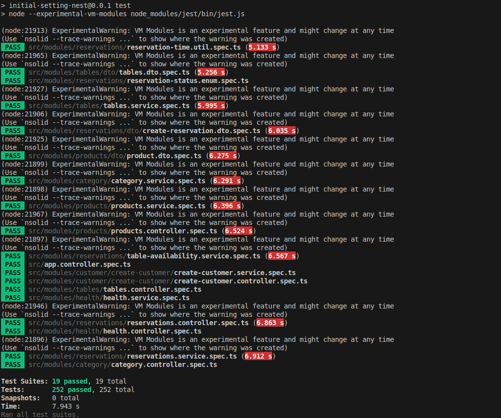
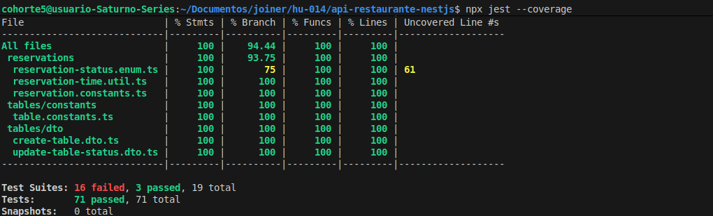

# User Story: Create Reservation (HU-007)

## Overview
This feature allows customers to register a new table reservation in the restaurant system. The system automatically assigns the best available table matching the party size, validates scheduling conflicts and operational constraints using a secure transactional mechanism, and initializes the reservation status as `PENDING`.

Endpoint Details
Method: POST

Route: /api/v1/reservations

Content-Type: application/json

Business Rules Implemented
The creation flow enforces the following rules in order:

RN-042: Rejects any reservation requested for a past date or time.

RN-043: Ensures the party size is a whole integer greater than zero.

RN-044: Validates that the assigned table has sufficient capacity for the requested guests.

RN-045: Prevents double-booking and schedule conflicts using pessimistic locking (pessimistic_write) within a single database transaction.

RN-046: Automatically assigns an initial status of PENDING to all new reservations.

RN-047: Guarantees that only operational tables can be assigned.

Example Request Body:

{
  "customerName": "Juan Polo",
  "phone": "+573001234567",
  "email": "aa@aa.com",
  "date": "2027-09-24",
  "time": "19:00",
  "guests": 4,
  "durationMinutes": 60
}

Respones

1. Success Response (201 Created)

{
  "id": "a1b2c3d4-e5f6-7890-abcd-ef0123456789",
  "customerName": "Juan Polo",
  "phone": "+573001234567",
  "email": "aa@aa.com",
  "date": "2027-09-24",
  "time": "19:00",
  "durationMinutes": 60,
  "quantity": 4,
  "status": "PENDING",
  "tableId": "tbl-uuid-1234",
  "createdAt": "2026-09-30T15:00:00.000Z",
  "updatedAt": "2026-09-30T15:00:00.000Z"
}

2. Bad Request (400 Bad Request)

{
  "statusCode": 400,
  "error": "Reservations cannot be registered for a past date or time (requested 2025-01-01 19:00)",
  "rule": "RN-042"
}

3. 3. Conflict (409 Conflict)

{
  "statusCode": 409,
  "error": "No table is free for the requested date and time",
  "rule": "RN-045",
  "reason": "SCHEDULE_CONFLICT"
}

tests

