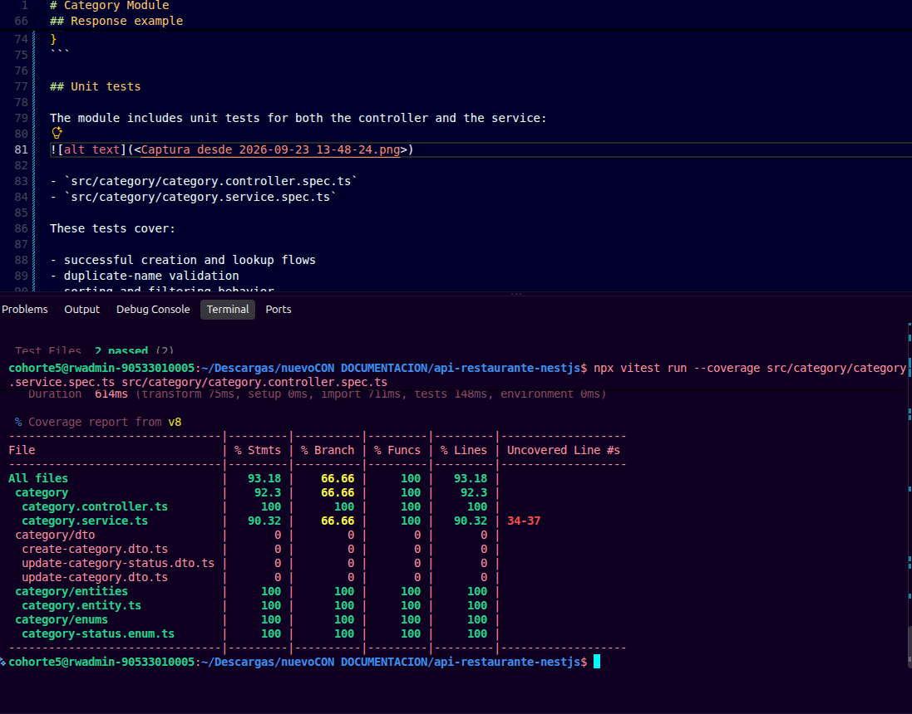

# Category Module

The `category` module manages the restaurant menu categories used to organize dishes and products by type.

## Purpose

This module allows administrators to:

- create new categories
- list all categories
- list only active categories for the public menu
- retrieve a single category by ID
- update the name and description
- activate or deactivate a category

Categories are identified by a unique name and always start with the `ACTIVE` status.

## Business rules

| Field | Type | Rules |
| --- | --- | --- |
| `id` | UUID | Automatically generated |
| `name` | string | Required, unique, trimmed before saving, 4-100 characters |
| `description` | string | Required, text content |
| `status` | enum | `ACTIVE` or `INACTIVE` |

Important rules:

- duplicate category names are rejected
- names are trimmed before validation and persistence
- active categories are returned by `GET /api/v1/category/available`
- inactive categories are hidden from the customer-facing menu

Examples of valid categories include: `Appetizers`, `Main Courses`, `Beverages`, `Desserts`, `Burgers`, and `Salads`.

## API endpoints

| Method | Route | Description |
| --- | --- | --- |
| `POST` | `/api/v1/categories` | Create a new category |
| `GET` | `/api/v1/categories` | List all categories for administrators |
| `GET` | `/api/v1/category/available` | List only active categories |
| `GET` | `/api/v1/category/:id` | Retrieve one category by ID |
| `PATCH` | `/api/v1/category/:id` | Update the name or description |
| `PATCH` | `/api/v1/category/:id/status` | Activate or deactivate a category |

## Request example

### Create category

```json
{
  "name": "Main Courses",
  "description": "Grilled and cooked dishes served as the main course."
}
```

### Update status

```json
{
  "status": "INACTIVE"
}
```

## Response example

```json
{
  "id": "3f2a7c1d-5b8e-4d0a-9c6f-123456789abc",
  "name": "Main Courses",
  "description": "Grilled and cooked dishes served as the main course.",
  "status": "ACTIVE"
}
```

## Unit tests

The module includes unit tests for both the controller and the service:


- `src/category/category.controller.spec.ts`
- `src/category/category.service.spec.ts`

These tests cover:

- successful creation and lookup flows
- duplicate-name validation
- sorting and filtering behavior
- category status updates
- missing-resource handling



The complete API contract is also documented with Swagger at `/api/docs` while the application is running.
